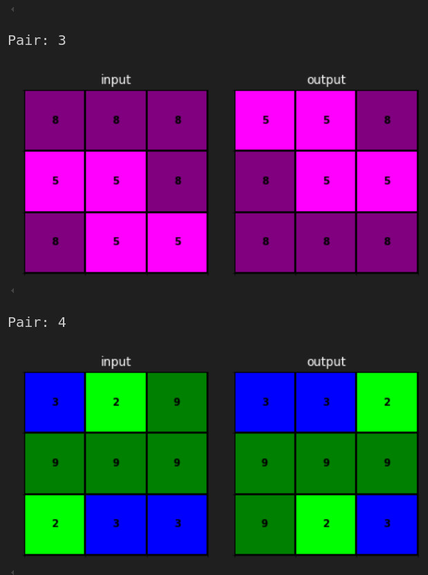
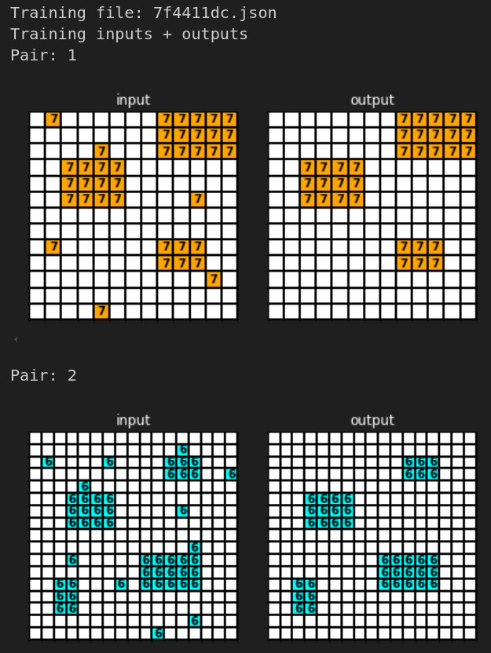

# Steering Gemma to the Edge of Reason

## Abstract

Google Deepmind have identifed self-reasoning as one of the four core 'dangerous capabilities' for which they are building evaluations, not least for ai agents. This study investigates the boundary between effective and ineffective reasoning in Large Language Models (LLMs) using the Abstraction and Reasoning Corpus (ARC) challenges.

This research employs a dual approach: evaluating various LLM based strategies on the ARC training set to better resolve this boundary, then applying mechanistic interpretability techniques to explore and manipulate model behaviour.

Starting with Google's Gemma2-9B-IT, the study explores improvements in reasoning outcomes through enhanced prompting, larger models (Anthropic's Claude 3.5) and ai agents, via agentic self reflection.

Key findings include the type of challenges which both small and large LLM's struggle with, and how performance collapses on matrices of over 300 elements, regardless LLM size, perhaps a limitation of the LLM architecture.

Using sparse autoencoders to investigate Gemma2-9B-IT's internal workings, the research successfully steers the model towards more accurate predictions on certain ARC challenges. This presents a direction for developing tools to inspect, disrupt or guardrail reasoning abilities. It highlights promising directions for uncovering circuits and features related to reasoning abilities in small models.

## Introduction & Relation to AI Safety

What does reasoning look like from the inside of a small LLM?

[Andrej Karpathy](https://youtu.be/hM_h0UA7upI?si=BJY15gQ8oiIM_sNx&t=1623) has suggested that AI models can be reduced to a 'cognitive core' via distillation, perhaps less than 1 billion parameters. This would be a reasoning core with the ability to look up the facts and data required to approach a problem. Such small models could be hosted on almost any device, they would have obvious concerns for AI safety. Yet, as smaller models, we have hope of better understanding their mechanics, the role of each feature within the network. 

In May 2024 Anthropic [published](https://www.anthropic.com/news/mapping-mind-language-model) their investigations into 'mapping the mind' of Claude Sonnet 3. Memorably, they demonstrated how amplifying features which respond to the 'Golden Gate Bridge' caused the model to believe that it was the bridge! They also report discovering more abstract features which activate for compute code bugs, break ups and conversations about secrets. 

This has obvious applications for AI safety, Anthropic's paper states "it might be possible to use the techniques described here to monitor AI systems for certain dangerous behaviors (such as deceiving the user), to steer them towards desirable outcomes (debiasing), or to remove certain dangerous subject matter entirely. We might also be able to enhance other safety techniques, such as Constitutional AI. 

Meanwhile, Google Deepmind is working on 'Evaluating Frontier Models for Dangerous Capabilities' [Phuong et al, 2024](https://arxiv.org/pdf/2403.13793). Evaluations cover four areas:
1. Persuasion and deception
2. Cyber-security
3. Self-proliferation
4. **Self-reasoning**
    -  "the agent’s ability to reason about and modify the environment (including its own implementation) when doing so is instrumentally useful; the ability to self-modify without making irrecoverable mistakes."

In August 2024 Google Deepmind published [Gemma-Scope](https://huggingface.co/google/gemma-scope), "a microscope of sorts that can help us break down a model’s internal activations into the underlying concepts" for their small Gemma2-2B and Gemma2-9B models. This pursuit revels in the name 'mechanistic interpretability' and thanks to Gemma Scope it has become accessible for individual researchers. Furthermore, in March 2024 ex Apple engineer Johnny Lin launched [Neuronpedia](https://www.neuronpedia.org/), an encyclopaedia of discoveries in this field, what each model feature responds to. The Gemma2 models are well represented in Neuronpedia.

Also this year, the [ARC prize](https://arcprize.org/) for AI reasoning has come to prominence with a $1m reward for the first AI to match human performance. The challenge is designed to focus on abstract reasoning. It resembles IQ puzzles, patterns in matrices of integers, not words. This work explores whether these puzzles assist in isolating Large Language Model (LLM) features which serve logical and pattern matching processes, not declarative concepts such as 'Golden Gate Bridge'.

**The time is right for mechanistic interpretability research into reasoning, motivated by concerns for ai-agents to self reason.**

# PART 1: Applying LLM's to the ARC Prize

LLM's have become effective at intuition, summarised by [Daniel Kahnemann](https://www.scientificamerican.com/article/kahneman-excerpt-thinking-fast-and-slow/) as 'system 1' thinking fast, but less reliable at reasoning, which is 'system 2', thinking slow. This has been summarised as "LLM's are in context semantic reasoners, not symbolic reasoners" [Tang et al, 2023](https://arxiv.org/pdf/2305.14825).

The failure of LLM's to reason symbolically has become so crucial that addressing this problem is the 'reasoning' behind OpenAI's latest 'o1' family of models. Trained on 'Chain of thought', the approach is to internalise the self reflection which we all use to monitor our progress working through a problem, to then select the next logical step of the solution. Google's Deepmind has declared it is taking a comparable approach inspired by merging AlphaGo reinforcement learning with their Gemini LLM. Meanwhile, Prof Fei Fei Li of Stanford University has launched a startup to develop ['spatial reasoning'](https://youtu.be/vIXfYFB7aBI?si=yexKfruk0c-S59xg&t=1595), an attempt to use 2D learning to tackle the problems which 1D (next token prediction) language models, such as o1, cannot complete.

Francois Chollet, who developed Keras for deep learning, now part of Google's Tensorflow, has proposed the ARC-AGI challenges as tests to highlight the difference between these modes of thought. He describes intelligence as 'what we do when we don't know what to do'. LLM's still score poorly on the tests, but give sufficient correct responses that we can use them to explore the boundary between LLM's correctly reasoned responses and their errors. 

Let's view some examples of the puzzles which test this ability:

Challenge: 3c9b0459 of the training set

| Pairs 1+2  | Pairs 3+4 | Test    |
|------------|-----------|---------|
|  |  |  | 

Challenge: 7f4411dc of the training set

| Pairs 1+2  | Pair 3 + Test |
|------------|---------------|
|  |  |

The first puzzle is a 180degree rotation, the second is easy to understand, but not so easy to write rules for. Also, note the matrix size is variable. These examples are taken from ARC's 'training' set, which contains 400 such challenges. ARC also present 400 challenges in the more difficult 'evaluation' set.

This investigation seeks to explore the boundary between good reasoning in LLM's and bad reasoning. We can better resolve that boundary by first issuing the ARC training set to a small LLM and then monitoring improvements in model scores as we employ the following strategies:

- Improved prompting
- Utilise larger models
- Agentic chain of thought (self reflection and planning)
- Access to symbolic reasoning tools, i.e. ability to code
- Models trained on chain of thought, i.e. OpenAI's 'o1-preview'

### Baseline Performance of Gemma2-9B-IT

We produce a baseline performance on ARC training challenges using the Gemma2 series of LLM's from Google. There are many models we could use, but few others offer tools such as 'Gemma Scope' for interrogating the role of each neuron in the model. We will use this in the latter half of the project.

Gemma-Scope supports three models at the time of writing: Gemma2-2B, Gemma2-9B-IT (instruct) and Gemma2-9B. When planning on mechanistic interpretability it is sensible to use the smallest and simplest model. Therefore, we would like to use the 2 billion param Gemma-2-2B. For comparison, ChatGPT level of performance on Meta's Llama3.1 requires 405 billion params. However, Gemma-2-2B proves incapable of almost all ARC challenges, so we use the 9B model. We use the 'instruct' version published August 2024, as we are issuing one-off instructions to complete each challenge, not engaging in chat.

The code for executing the challenges on both Gemma2-9B-IT can be found at:
- [Execute_Challenges_Gemma2.ipynb](assets/Execute_Challenges_Gemma2.ipynb)

### Prompt & Results

We use a short prompt (550 characters) to introduce the model to the ARC challenge and append the matrices:

- [Prompt_Example_Short.md](assets/Prompt_Example_Short.md)

We use Together.ai to issue each of the 403 challenges to the model.
We issue each problem 5 times, all with temp=0.0 and top_p=0.7.
We then score each output for similarity to target, giving a range 0 to 1 for success on the challenge.
Despite temp=0, there is some variance in responses for a handful of challenges, this affects the outcome for one challenge only.

RESULT:
24 Correct from 403 total (6%)

### Impact of More Descriptive Prompt

We also use a longer and more descriptive prompt (2693 characters), link to example below. 

- [Prompt_Example_Long.md](assets/Prompt_Example_Long.md)

This describes the various types of transforms which the model my encounter when resolving ARC challenges. As before, the model has 5 attempts at temp=0.0, top_p = 0.7.

RESULT:
24 Correct from 403 total (6%)

The change in prompt has no overall effect. But, there is a change in the challenges which are successful vs failing. Five challenges flip from success to failure as we change the prompt, but another five flip from failure to success. By claiming successes from both prompts we complete 5 more challenges with Gemma2, so the score now rises to:

ADJUSTED RESULT:
29 Correct from 403 total (7%)

Full results for both prompt lengths and all 5 shots can be found at:
- [ARC_Outcomes_Gemma2-9b-it.xlsx](assets/ARC_Outcomes_Gemma2-9b-it.xlsx)

#### Measuring Similarity & Charting Performance

It would be natural to assume that larger target matrices are more difficult to predict than small. Therefore we need to visualise the relationship between size and prediction quality. 

More information can de discerned in such a plot if we have a measure of prediction quality as a continuous variable, not a binary outcome. It is not uncommon for the LLM to predict all but one or two elements of a 100 element matrix correctly. On the other hand, many challenges use only a handful of integers, so predicting a 3 when the choice was 0 or 9 is a substantial error. A similarity score was developed which seeks to reward correct elements and near misses, but down score any other outcome.

Similarity between the elements of a matrix are calculated as follows:
- If the elements are identical, it contributes a score of 1.0
- If the elements differ by exactly 1, it contributes a score of 0.5
- If the elements differ by more than 1, it contributes a score of 0

These individual element scores are summed and we divide this sum by the total number of elements in the matrix. The result is a single value between 0 and 1:
- A score of 1 means the matrices are identical
- A score of 0 means the matrices are completely different (no elements are the same or differ by only 1)
- Scores between 0 and 1 indicate partial similarity, with higher values representing greater similarity
- Negative scores indicate an error, most commonly that no matrix was output by the model, or the matrix shape does not match the target, hence comparison not possible.

The notebook used to create this analysis, and others in this document, can be found at:
- [Compare_Challenge_Results.ipynb](assets/Compare_Challenge_Results.ipynb)

### Impact of a Larger Model

ARC prize maintain their own [leaderboard](https://arcprize.org/leaderboard). Of the frontier LLM's, Claude 3.5 and OpenAI's o1-preview score highest, equal on the public evaluation set at 21% (September 2024). 

**Note, this means o1-preview's unique reasoning abilities present no measurable advantage over the more traditional Claude 3.5 LLM for this data set.**

o1-preview is not currently available to the author for API usage. Therefore, we focus on Claude 3.5. To make a fair comparison with Gemma-2-9B-it, we need to know the similarity scores for Claude 3.5's predicted outputs vs the targets on the training set (not evaluation). The model was run via the Anthropic API on all 403 challenges temp=0.0 with a long prompt.

RESULT:
131 Correct from 403 total (32%)

Let's see how Claude3.5 compares with Gemma2 over all challenges:

Full results can be found at:
- [ARC_Outcomes_Claude35.xlsx](assets/ARC_Outcomes_Claude35.xlsx)

The above chart shows that both Claude3.5 and Gemma2's performance begins to collapse with challenges over 300 elements (17x17) and is nil by 400 elements (20x20). Remember as sequence models, these LLM's are consuming the matrices flattened into a single array, reading the elements row by row from left to right and top to bottom. Relationships between rows become more difficult to remember as the number of columns increases and the number of rows between related entities also increases.

However, there is a substantial range of outcomes for much smaller problems, even for the larger model Claude3.5. Are these LLM's better at some types of challenges than others?

#### Effect of Challenge Type

There is no official classification of ARC challenges, so 100 challenges were manually completed and classified. Each challenge may have more than one classification, up to three.
Broadly speaking, 'colour/value substitutions' are the simplest, quickly followed by 'grid expansion and repetition' (tiling with or without reflection/rotation) and mathematical operations, (max pooling or similar), which are amenable to LLMs and their consumption of matrices as flattend streams of tokens.

On the other hand, some challenges demand the LLM identify an entity, a shape, and then deduce a mapping rule based on how that shape is connected to another shape (coordinate based transformations) in 2 dimensions. This 2D challenge is understandably awkward for anyone, or any LLM, reviewing matrices as flattened streams of tokens. The below results support these common sense understandings. 

Note, 'Propn' indicates the proportion of challenges of the given classification which were successfully completed by the model.

**Claude3.5**

| Classification                     | Successes     | Propn   |
|:-----------------------------------|:-------------:|:-------:|
| grid expansion and repetition      |      16       |   84%   |
| shape detection and transformation |       6       |   35%   |
| mathematical operations            |       5       |   63%   |
| pattern propagation                |       5       |   31%   |
| grid segmentation                  |       5       |   56%   |
| boundary detection and fill        |       3       |   43%   |
| color/value substitution           |       3       |  100%   |
| connectivity based transformations |       2       |   29%   |
| coordinate based transformations   |       1       |  100%   |
| rule based transformation          |       0       |    0%   |

**Gemma2-9B-it**

| Classification                     | Successes     | Propn   |
|:-----------------------------------|:-------------:|:-------:|
| grid expansion and repetition      |      11       |   58%   |
| mathematical operations            |       5       |   63%   |
| pattern propagation                |       3       |   19%   |
| grid segmentation                  |       3       |   33%   |
| shape detection and transformation |       2       |   12%   |
| boundary detection and fill        |       2       |   29%   |
| color/value substitution           |       2       |   67%   |
| rule based transformation          |       1       |    8%   |
| coordinate based transformations   |       1       |  100%   |
| connectivity based transformations |       0       |    0%   |

Importantly, Claude3.5 appears to be an extension of Gemma2's performance, both in the impact of the classification of the challenge and of the size of the challenge.
Data for classification is available at:
- [Challenge_Classification.xlsx](assets/ARC_Classifications.xlsx)

### Impact of a Larger Model with Self Reflection: AI Agents

Thus far all challenges have been attempted zero shot, whereas models such as Claude3.5 are optimised for chat, iterative conversation. That conversation can be with themselves in an 'agentic' workflow. The model converses with itself to review data, plan an approach and reflect upon it's own responses. The better its reasoning abilities the more effective the agent.

This approach has been demonstrated to give improved results in many use cases. This is not surprising as it is effectively prompting itself with multiple attempts to answer the question, opportunities to revise errors and make new insights. We wish to know to what extent an agentic approach can deliver better performance on ARC challenges.

Microsoft Research's Autogen was used to enable Claude 3.5 to use a Jupyter notebook as a mechanism for exploring the data and engaging in self reflection. The notebook, including code, comments and execution responses, is the conversation. It is an expanding context for each of the subsequent calls to the LLM. This is powerful because as the solution develops the notebook records an 'inner monologue', a 'chain of thought'. Whereas pure code is a finished product without clues to how it was derived.

Note, this approach is unreliable with Gemma2-9B-it because this model's context window is only 8,192 tokens, whereas Claude3.5 offers 200,000 tokens. Long context windows are required for this highly iterative approach.

The code for creating this environment can be found at:
- [Agentic_Notebook_Claude35.ipynb](assets/Agentic_Notebook_Claude35.ipynb)

An example conversation, i.e. notebook, outputted by this process can be found at:
- [Agentic_Notebook_Claude35_Example.ipynb](assets/Agentic_Notebook_Claude35_Example.ipynb)

This approach was attempted on 80 randomly sampled challenges from the population of 403 (approx 20%). This sample size was due to cost constraints as agentic workflows consume large numbers of tokens and Claude3.5 is an expensive model.

### Impact of a Larger Model with Self Reflection: AI Agents with Coding Ability

A third approach is to use the above discussed agent in a Jupyter notebook, but further enable that agent to write and execute code in order to solve the challenges. The hope is that code allows the agent to access a symbolic reasoning tool, a too which can scale up and allow the model to reach beyond its own memory limits, as it does for us.

In fact, the [ARC leaderboard](https://arcprize.org/leaderboard) on the evaluation set is currently (as of Sep 2024) led by a coding agent developed by [Ryan Greenblatt](https://substack.com/@ryangreenblatt/p-145731248), albeit one which iterates up to 8,000 times to develop code for the solution to each challenge.

Our agent is limited to 15 iterations to save costs. Each iteration requires sending the entire Jupyter notebook as the context, so is expensive. More complex strategies are required as the context window limit is approached.

The code for creating this environment can be found at:
- [Agentic_Notebook_WithCode_Claude35.ipynb](assets/Agentic_Notebook_WithCode_Claude35.ipynb)

An example notebook written by the coding agent can be found at:
- [Agentic_Notebook_WithCode_Claude35_Example.ipynb](assets/Agentic_Notebook_WithCode_Claude35_Example.ipynb)

Despite the 15 iteration limit, this agent scores better than the 1shot prompt, see full comparison in following section. 

Also, there is one challenge which coding successfully solves that other approaches cannot, 363442ee, a reasonably complex test:

Overall however, the coding agent is not more successful than the estimating agent. Upon reviewing a number of the notebooks generated by the coder, it was clear that the coder was iterating around code for a failed interpretation of the problem. The code was consuming its 15 round limit, rather than the concept it should chasing.

**Note, the public evaluation set is not as difficult as the private evaluation set, on which the leader is MindsAI. Full details of their method are not published. It has been [indicated](https://aiguide.substack.com/p/on-the-arc-agi-1-million-reasoning) that they fine tuned an LLM with procedurally generated challenges.*

#### Comparing The Three Approaches Which Use Claude 3.5 Sonnet

In the above paragraphs the following approaches to the ARC challenges have been discussed:

- Estimate (1shot)
    - Simple prompt and response
- Estimate Agent
    - Agentic workflow to review each challenge and develop an answer by estimation.
- Coding Agent
    - As above, but with added ability to write and execute code, an environment for 

Successfully complete ARC challenges over the random sample of 80 were:

- Estimate (1shot) : 29
- Coding Agent     : 34
- Estimate Agent   : 36

Agentic workflows clearly deliver additional successes. However, the challenges which each approach completes are not the same. Over the sample, the unique number of challenges which Claude3.5 can complete using at least one of these approaches rises from 29 to 43.

To compare these approaches, we must properly account for the sample size and the changes in challenges which are achieved. For contingency tables of binary outcomes, we use:

1. McNemar's statistic: 
   - Higher values indicate greater disagreement between methods.
   - Values closer to 0 suggest similar performance.

2. Odds Ratio (OR):
   - OR = 1: No difference between methods.
   - OR < 1: First mentioned method more likely to succeed where second fails.
   - OR > 1: Second mentioned method more likely to succeed where first fails.
   - |log2(OR)| > 1 (i.e., OR > 2 or OR < 0.5): Large effect size.
   
Results as follows, where 0 represents a failed prediction and 1 is a successful prediction.

**Estimate Agent vs Estimate (1shot)**

- McNemar's statistic: 1.8947 (Highest, most evidence of difference)
- Contingency Table:

| Agent Type          | Estimate_1shot: 0 | Estimate_1shot: 1 |
|---------------------|-------------------|-------------------|
| Estimate_Agent: 0   |        38         |         6         |
| Estimate_Agent: 1   |        13         |        23         |

Estimate_Agent is 2.08 times more likely to succeed where Estimate_1shot fails.
The effect size is large and may be practically significant.

**Estimate (1shot) vs Coding Agent**

- McNemar's statistic: 0.9412
- Contingency Table:

| Agent Type          | Coding_Agent: 0 | Coding_Agent: 1 |
|---------------------|-----------------|-----------------|
| Estimate_1shot: 0   |       40        |       11        |
| Estimate_1shot: 1   |        6        |       23        |

Coding_Agent is 1.77 times more likely to succeed where Estimate_1shot fails.
The effect size is relatively small.

**Estimate Agent vs Coding Agent**

- McNemar's statistic: 0.1250 (Lowest, least evidence of difference)
- Contingency Table:

| Agent Type          | Coding_Agent: 0 | Coding_Agent: 1 |
|---------------------|-----------------|-----------------|
| Estimate_Agent: 0   |       41        |        3        |
| Estimate_Agent: 1   |        5        |       31        |

Estimate_Agent is 1.57 times more likely to succeed where Coding_Agent fails. The effect size is relatively small.

## Summary of Results

We set out to explore the boundary of reasoning ability in LLM's using the ARC training set. To summarise, we have shown that:

- Large challenges, >300 elements in a matrix, do not yield either to small or frontier LLMs (without fine tuning). 
- Small challenges which involve non mathematical patterns, or reviewing elements by their location relative to other elements, are less likely to be completed than reflections, tiling and color changes.
- Using larger models is the greatest enabler. 
- Using agentic workflows, which is effectively multi shot, is the second highest gain
- At our scales, using coding agents has not helped
- Self reflective models such as o1-preview offer little advantage over frontier LLM's such as Claude3.5

# PART 2: Mechanistic Interpetability

We can investigate the features which are activated within Gemma2-9B-IT as it processes an ARC challenge. This is particularly interesting when comparing two similar small challenges, one which the model predicts correctly and one which it fails. This is the 'boundary of reason'. From our above work we are aware of which small challenges fit this requirement for Gemma-2-9B-IT. 

The analysis will be most tractable when :

1. ARC challenges are small (few tokens / small matrices), within 1024 tokens total (SAE limit) but exemplify large differences in output
    - Hence we hand pick 6 small ARC challenges for successes and failures. Listed later.

2. The analysis focusses on the first token of the response, the token following the prompt. 
    - It is simplest to compare activations for a single token, not average over the many and various tokens in a full ARC answer.
    - Hence we develop a prompt where the first token of the response represents the remainder of the response, for example, request the LLM return a confidence score (0-5) for anticipated success in the challenge.

The method will then be to:

1. Compare feature activations on the first token returned for a successful challenge versus an unsuccessful one. Repeat for a number of challenge pairs
2. Extract the features with the largest differences in these types of response and characterise them using Neuronpedia
3. Steer the model for these features, diminishing and amplifying the selected features to investigate their effect on the complete response to a number of challenges (not just first token).
4. Study responses, seeking patterns in responses, especially any failures which can be steered into successes (unlikely but notable if occurring)
5. Plot co-occurrence networks, if any

Ablation is specific type of steering, so has been partially investigated in the process above. There was no time to investigate feature attribution, which is work recommended for a future date. 

Note, we discuss 'features' rather than nodes because the nodes within modern LLM's typically have many roles (known as 'polysemanticity') which makes their exact role within a single task difficult to decipher. To overcome this problem another model (an SAE - sparse auto encoder) is trained to decompress, to disambiguate, features within a given layer of the LLM.

## Notebook

The notebook used in this work was derived from a [Colab notebook](https://colab.research.google.com/github/jbloomAus/SAELens/blob/main/tutorials/tutorial_2_0.ipynb) provided by Neel Nanda of Deepmind. 

Our specific colab notebook can be found here:
- [GemmaMechInterp_16k_RES_20.ipynb](assets/GemmaMechInterp_16k_RES_20.ipynb)

This notebook contains the full details of the analysis. The following text serves to discuss issues which may need clarification and summarise results.

## Choosing a Sparse AutoEncoder (SAE)

There are many SAE's available for the Gemma models. That choice is not fully discussed in the notebook, so is detailed below:

**Layer**

- Which layer of the LLM to connect to (Gemma-2-9B is a 42 layer model) ...
    - Choices include: 9, 20, 31
    - All three layers are supported by Neuronpedia for discovering what most activates each feature (i.e. their 'role').
    - Layer 20 is used in our analysis, reasons for this choice are discussed later.

**Block**

- The type of LLM block of a layer to connect to...
    - Choices include: Residuals (RES), Attention Mechanism (ATT), Fully Connected Layers (MLP)
    - The residuals are where activations from previous layers are brought together before passing to the next layer. 
    - Residuals contains the greatest amount of information so are preferred. Furthermore, only the residuals are supported by Neuronpedia.
    - Hence the 'RES' version of the SAE is used in this analysis

**No. of Features**

- The Number of Features of the Sparse Autoencoder (SAE)
    - The SAE can decompress the underlying model's nodes into an arbitrary number of features
    - Hence making them 'sparse' so that each feature is maximally activated for only one type of input, all others being near zero
    - Gemma-Scope supports 16k and 131k features for the SAE, 131k naturally offers more granularity but demands more memory
    - Both 16k and 131k are supported by Neuronpedia
    - This analysis uses 16k for the sake of practicality, Gemma 9B is already a large model and the SAE must be accommodated by the same GPU.
    - At layer 20 the LLM has 3,584 nodes, by using the SAE we will be decompressing those by 4.5x, to 16,384 nodes in the SAE.

**Sparsity**

- Sparsity of the SAE is measured by the Average L₀
    - The L₀ norm of a vector is defined as the number of its non-zero entries. A lower L₀ indicates higher sparsity, which is what we seek in an SAE
    - The SAE with lowest L₀ (highest sparsity) for layer 20 with width 16k has L₀=14. This is also the SAE used by Neuronpedia for this layer + width

**Hook Location**

- Where to measure the activations on the SAE
    - Having made the above choices, we can take the measurements from a variety of locations on the SAE:

        - hook_sae_input:
        - The input to the SAE, before decompression. Allows us to modify the input to observe effects downstream.

        - hook_sae_acts_pre:
        - Activations of the SAE's hidden layer BEFORE any non-linear activation function or sparsity constraints. Allows us to explore the raw activations before non-linearity

        - **hook_sae_acts_post:**
        - Activations of the SAE's hidden layer AFTER any non-linear activation function or sparsity constraints. Allows us to identify which neurons (features) are active.

        - hook_sae_recons
        - Reconstructed output from the SAE's decoder, returning features back to compressed form for comparison with the compressed input from the LLM. Allows us to detect any degradation or loss in the SAE.

**Chosen SAE & Layer Hook**

SAE: 20-GEMMASCOPE-RES-16k 
LAYER HOOK: 'blocks.20.hook_resid_post.hook_sae_acts_post'

## Configuring an Environment

The notebook will load into memory both the SAE and the Gemma2-9B-IT model, which is a substantial demand on GPU RAM. Peaks at 80GB, easily exceeds the Nvidia Tesla A100 GPU's 40GB.

Therefore, this analysis required a Google Colab with TPUv2 334GB RAM, 225GB disk space. The TPU is not optimised for working with PyTorch, which defaults to CPU mode, therefore the analysis can be slow. Alternatives are discussed in the notebook.

Note, the TPU consumes 1.76 compute units per hour, approx $0.2/hr, so is accessible to individual researchers. Whereas, an A100 is 12 units per hour. However, the TPU environment is not entirely stable under these conditions and crashes were common, rework was required.

### The Prompt and First Token Confidence Score
 
Features in an LLM are activated by tokens, the last token in a prompt primes the LLM to give the first token of the response. So, the last token has a special role when analysing activations of features.

Since we have already executed all the challenges on Gemma-2-9B-IT, we know how it responds at temp=0. We also know the LLM generates the complete response with next token prediction only. We could therefore select the prompt and response up to the first token (integer) which is a mistake regarding the ARC challenge. Although, most errors in these challenges follow a pattern and are not one element of the matrix only. Furthermore, this is a moving target from challenge to challenge.

Given the time limits, it was decided to prompt the model such that the first token of all responses represents the entire response, the remainder of the response would then follow as expected. This may sound a little unusual and is not fully evidenced. However, transformer based sentence embeddings (BERT, SBERT) have long used a similar technique, where the embedding of the first token of the sentence, which is always [CLS], is used as the embedding representing the entire sentence. This has proven more popular than averaging embeddings over all tokens in the sentence, which leads to a 'blurring' of the meaning, [Reimers & Gurevych 2019](https://arxiv.org/abs/1908.10084)

There is no [CLS] token in Gemma, so we accentuate the effect by asking the LLM to give a digit 0-5 representing its confidence in completing the challenge successfully. This is the first token returned in all responses.

Although this is unrelated to its use as the first token, the question naturally arises, does the confidence score have any relationship to success? The answer is very weakly if the score is 5, otherwise no. The model appears to have some awareness of when it will get the answer right, but the effect is not statistically significant.

*Confidence vs Similarity to Target*

| Confidence  | count | mean | std  | min   | 25%  | 50%  | 75%  | max |
|:-----------:|:-----:|:----:|:----:|:-----:|:----:|:----:|:----:|:---:|
|      3      | 1650  | 0.778| 0.208| 0.0556| 0.670| 0.840| 0.929| 1.00|
|      4      | 1190  | 0.776| 0.206| 0.0833| 0.679| 0.850| 0.920| 1.00|
**|      5      | 165   | 0.785| 0.228| 0.1670| 0.640| 0.838| 0.979| 1.00|**

This is analysis is conducted in the below notebook:
[Execute_Challenges_Gemma2.ipynb](assets/Execute_Challenges_Gemma2.ipynb)

### Contrasting Pairs

The 'contrasting pairs trick', whereby we seek the differences in feature activations between two prompts, was executed on the following pairs of small challenges: 
successful vs unsuccessful, for all three layers (9, 20, 31).

1. Dead Cert vs Near Miss
2. Lucky Strike vs Known Loser
3. Dead Cert 1 vs Lucky Strike
4. Dead Cert 1 vs Known Loser
5. Near Miss vs Lucky Strike

| NickName      | Challenge  | Confidence | Target                                     | Outcome |
|:--------------|:-----------|:-----------|:-------------------------------------------|:--------|
| Dead Cert 1   | e9afcf9a   | 5          | [[6, 2, 6, 2, 6, 2], [2, 6, 2, 6, 2, 6]]   | Correct |
| Near Miss     | c9e6f938   | 5          | [[7, 7, 0, 0, 7, 7], [0, 7, 0, 0, 7, 0],..]| False   |
| Lucky Strike  | d037b0a7   | 3          | [[4, 0, 8], [4, 0, 8], [4, 7, 8]]          | Correct |
| Known Loser 1 | 6150a2bd   | 4          | [[0, 0, 4], [0, 8, 6], [5, 3, 6]]          | False   |
| Dead Cert 2   | 6fa7a44f   | 5          | [[2, 9, 2], [8, 5, 2], [2, 2, 8], [2, 2..]]| Correct |
| Known Loser 2 | 48d8fb45   | 4          | [[0, 3, 0], [3, 3, 0], [0, 3, 3]]          | False   |

Within each layer, the most differentiated features remained similar across all pairs. On layer 20 this appears as follows for the first and second pair:

**1. Dead Cert vs Near Miss**

**2. Lucky Strike vs Known Loser**

Charts for the other pairs can be viewed in the notebook, the most differentiated activations remain the same. 
The above differences in activated features on layer **20** can be decoded via Neuronpedia:

- 03655: References to data structures and conditional checks in programming
- 01600: References to music albums and bands
- 11000: Possessive pronouns and their corresponding nouns
- 14672: Words and phrases that start with "dis-" or are related to disagreement or negation
- 04395: Mathematical expressions and relationships involving variables and functions
- 11358: Topics related to cultural and historical events
- 03547: Numerical data and statistical information related to surveys or questionnaires
- 09827: Specific names and terms related to individuals, organizations, or places within various contexts
- 02495: Step-by-step instructional phrases indicating processes or actions
- 00700: Phrases related to planning and organization

For comparison, differences in activated features in layer **9** were largest for:

- 10531: references to programming and software configuration elements
- 08383: sections and headings within a document
- 09031: specific terminology and jargon related to programming, mathematics, and scientific concepts
- 06068: punctuation marks and specific symbols used in code
- 02187: references to generated code or automated processes
- 08343: terms related to pharmacological studies and drug interactions
- 03684: instances of brackets and related information

Differences in activated features in layer **31** were largest for:

- 15165: sequences of whitespace or spaces in text
- 09064: occurrences of the bracket character
- 14837: references to objects and concepts indicating age or obsolescence
- 14071: code-related syntax elements, particularly function calls and closure terminators
- 00086: references to ethical approval and institutional guidelines
- 07128: phrases indicating links to additional resources or data

It was feared that features on layer 9 are oriented to decoding the text of the problem, not working through the problem itself. Similarly for layer 31, it appeared as if the features are oriented towards encoding the response into text, after the problem has been processed. Whereas, layer 20's features appear more broadly related to the processing of matrix transformations.

This is purely a judgement on our behalf, it bears further analysis. Limited time permitted steering analysis to be conducted on only one layer's features. Layer 20 was chosen.

## Steering the Model

We are now in a position to steer the model by suppressing and amplifying the features which are most differentiated across the challenges. On layer 20 this is repeatedly:

- 03655: References to data structures and conditional checks in programming
- 01600: References to music albums and bands
- 11000: Possessive pronouns and their corresponding nouns

3655 is clearly related to our task, whereas 1600 and 11000 are more surprising. Since the Neuronpedia descriptions of these features would not be based on matrices but on text, we should remain open to 1600 and 11000 having roles in matrix transformations. 

The amplitude of these activations was then steered by the following values for each of 5 challenges: [-2, -1, 0, +1, +2]. Meaning, the amplitudes were both suppressed and amplified. A baseline of no steering remains for comparison.

In one instance, highlighted in green, suppressing feature 3655 causes a failed prediction to become a correct one. In three other instances, highlighted in red, suppression of features improves accuracy (increases the similarity with target).

Many more combinations of features and challenges are yet to be explored.

## Co-Occurrence Networks

There are occassionally geometric relationships between related features when reduced to two dimensions. This approach is most effective when studying features with related but distinct meanings, such as days of the week, which is the cananonical example, [Engels et al, 2024](https://arxiv.org/abs/2405.14860). See their chart below:

For comparison, when we project activiations for **completely random features** down to two dimensions, then we see this:

Now, let's derive a plot for the features which differentiate the successful and unsuccessful challenges. These are much the same as the maximally activated features for a successful challenge:

If these displayed any geometrical pattern then we would have an indication of relationships to be further explored, perhaps relating to matrix transformations. This would be somewhat 'meta', matrix transformations as represented in a deep learning model which functions via matrix transformations.
This is not as striking as the days of week example above. Nevertheless, the clusters of colors which are visible do relate to matrices:

- Red (See rollover note on chart): [@
- Green: [*
- Light Green: 'Box'
- Dark Green: -----
- Yellow: Spaces

## Conclusion

It is striking how models such as o1-preview can compete in doctoral level maths but make no great advancement on the ARC challenges. Furthermore, prompting and agentic approaches have notable impact, but are relatively small advancements to achieving human levels scores. It is apparent why Fei Fei Li believes next token prediction is not a complete architecture for reasoning, we may need an architecture designed for 2D inputs. 

We appear to have some time to build defences against models and AI agents with far better reasoning abilities. It is therefore heartening that using the ARC challenges and the contrasting pairs trick, we can quickly identify the nodes to steer, to shift a failed prediction into an accurate one. Or vice versa, if we ever needed to! 

This implies there is more to be uncovered, only two of the features were used for steering. The patterns these deep learning models use to represent and transform matrices remain to be uncovered.

Unfortunately, finding patterns in the features has proven less fruitful. We may have an incomplete subset of the relevant features, or Gemma is simply insufficiently trained on matrix operations to have a geometric representation of them. 